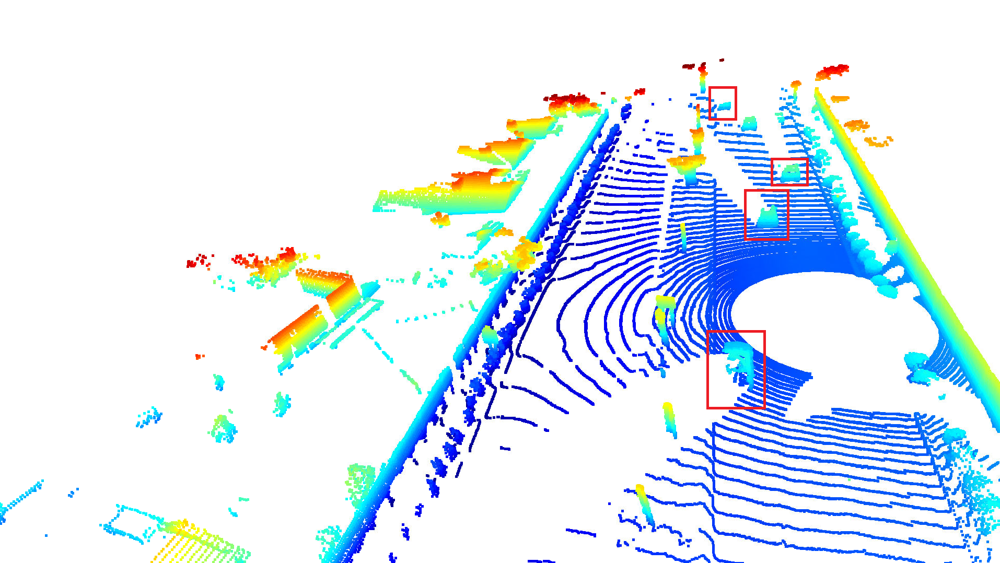
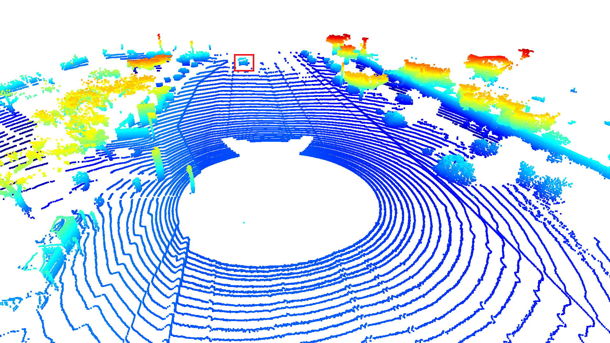
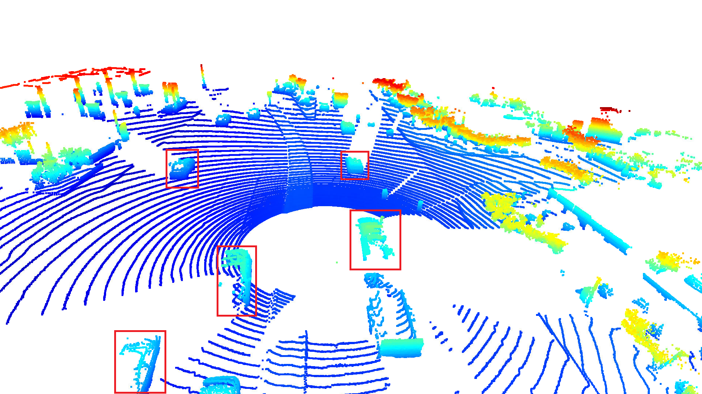
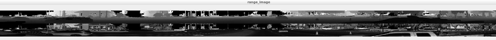
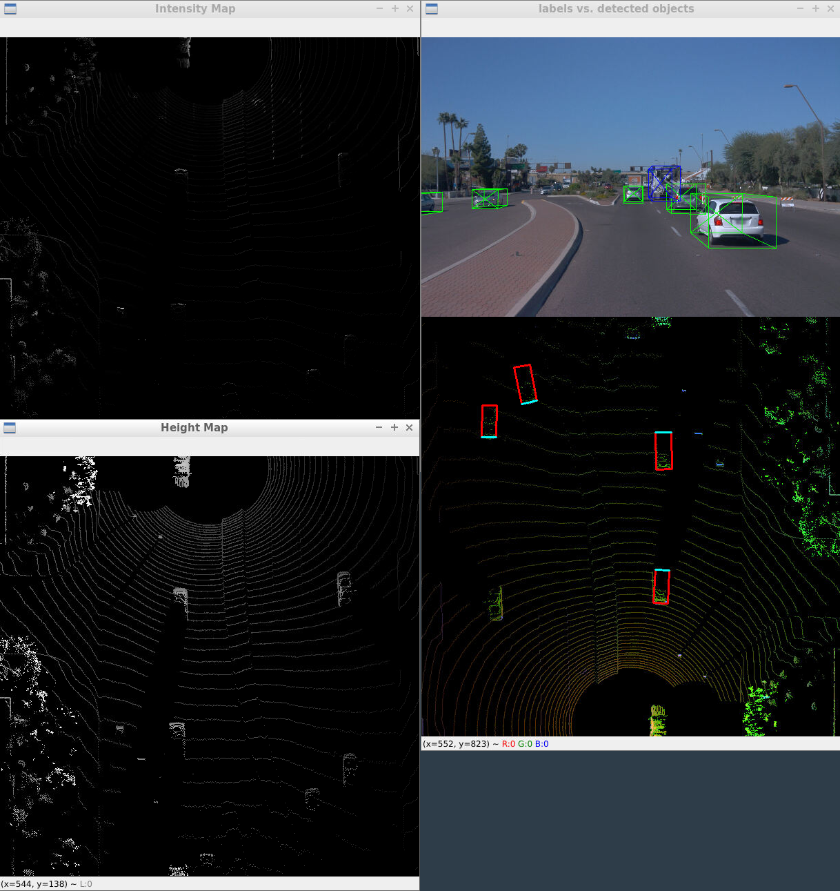
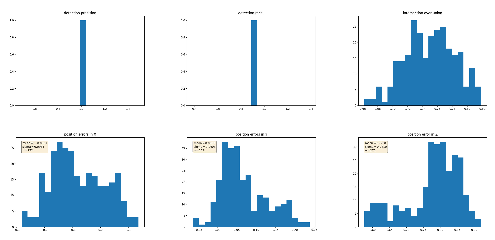

# Midterm: 3D Object Detection Writeup

### Examples of Vehicles with Varying Degrees of Visibility

### Range Image

### BEV Intensity and Height Maps

### Discussion
The feature that stands out as the most prominent is the vehicle's bumper, however large panes of glass like the vehicles' windshield also appear as 
blank spaces in the intensity map. Headlights and tail lights also stand out prominently in the camera image.

### Pre-trained Detection Model Performance
I evaluated the peformance using frames 50 to 150 on `training_segment-1005081002024129653_5313_150_5333_150_with_camera_labels.tfrecord`, using the resnet pretrained model to perform detection
precision = 98.9%, recall = 88.9%

