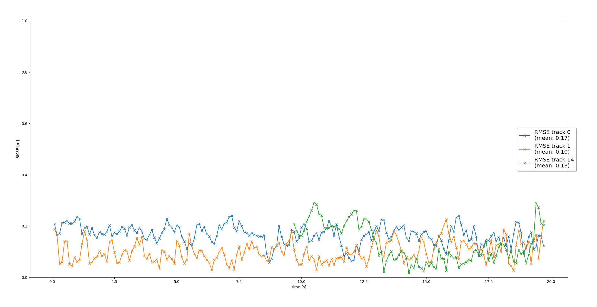
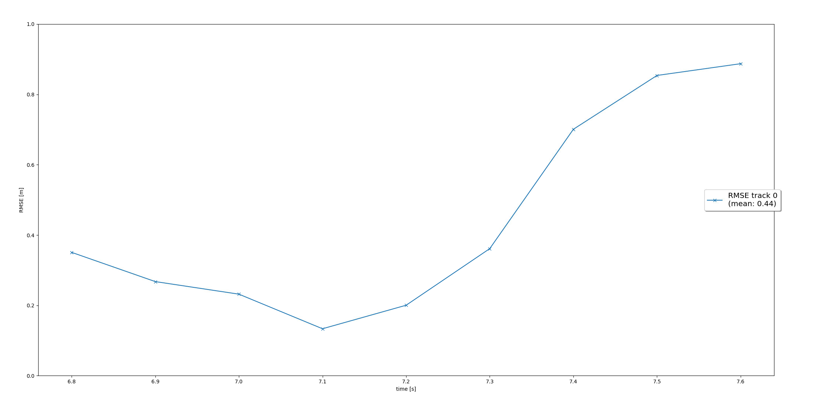
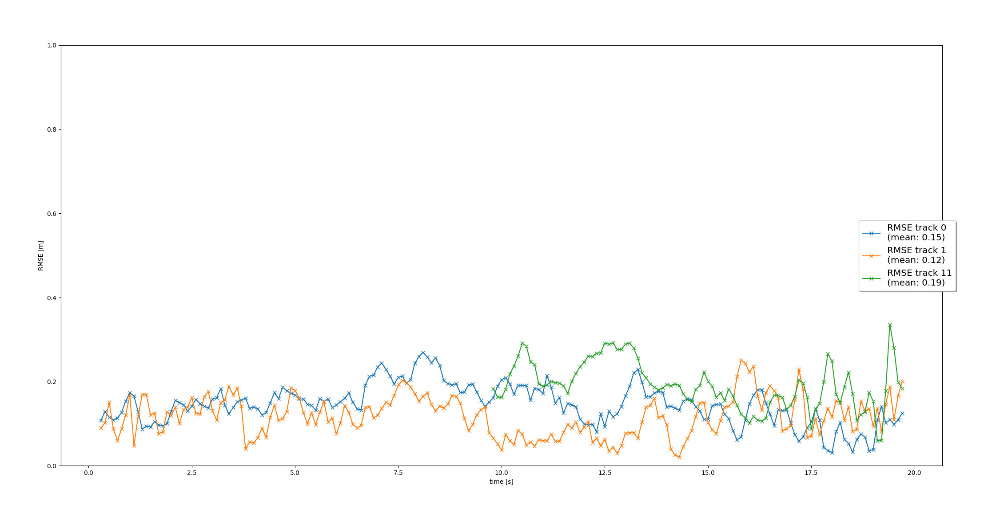

# Writeup: Track 3D-Objects Over Time

### RMSE Graph

### 1. Write a short recap of the four tracking steps and what you implemented there (filter, track management, association, camera fusion). Which results did you achieve? Which part of the project was most difficult for you to complete, and why?
**Filter:** The first step was to implement a Kalman filter to fuse predicted postions and sensor measurements to allow for tracking of an object through time. To begin with, this was only done with lidar measurements, however the implementation 
is designed to work with other sensor measurements as well (implemented later in the project)

#### Kalman Filter RMSE Graph

**Track Management:** The second step was to create logic for the intialization, scoring, and deletion of tracks. This is crucial for multi-target tracking and general system performance. It is probably where I spent the most time throughout the project, turning exactly how the scoring was handled in order to properly delete tracks.

#### Track Management RMSE Graph

**Association:** The third step was implementing an association matrix to be able to associate tracks and their closest measurements. Tracks and measurements with the closest Mahalanobis distance get associated together in the matrix and updated. They are then removed from the association matrix.
Additionally, tracks and measurements which are too far away to be associated together need to be managed as well. Unassociated tracks will have their score decreased and eventually deleted if they remain unassociated.

#### Association RMSE Graph

**Camera Fusion:** The fourth and final step was to integrate measurements from the vehicles camera as well. To do this appropriately, two things needed to be taken into consideration: the camera's field of view and the transformation from the camera sensor coordinates on a 2D plane into the 3D space of the self driving vehicle.

#### Camera Fusion RMSE Graph

### 2. Do you see any benefits in camera-lidar fusion compared to lidar-only tracking (in theory and in your concrete results)? 
Yes, definitely. When testing with only lidar measurements, false positives would occur often around the vegetation to the right of the road. The false positive tracks would persist for quite a while. Once the camera sensor data was fused with the lidar tracking, however, the false tracks were quickly identified and deleted.
This hold true to the theory behind fusing multiple sensor measurements, as each sensor does well for different things and in fusing the two you get petter performance than what you would get using only one or the other.

### 3. Which challenges will a sensor fusion system face in real-life scenarios? Did you see any of these challenges in the project?
Tuning the track management scoring to properly weed out false positives while also avoiding false negatives seems really tricky. Also, while the tracking of vehicles is (relatively) straightforward, tracking pedestrians would be a lot more challenging to do well. Two problems that would need to be
addressed there would be the fact that pedestrians can move and change direction much more quickly, and that pedestrians can often be grouped together much closer, resulting in association difficulties. I am sure there are other problems though.

### 4. Can you think of ways to improve your tracking results in the future?
The most obvious one would be to implement a more advanced association technique, such as Global Nearest Neighbor or Probabalistic Data Association. Another simple improvement would be changing the motion model used in our prediction step from a linear model to something more like a bicycle model.
